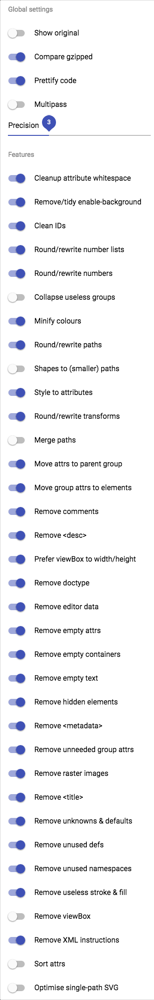

# Guidelines to contribute

1. Fork it!
1. Create the SVG file.

   1. SVG Tutorial: [How to work with SVG icons](http://fvsch.com/code/svg-icons/how-to/).
   1. Use [SVGOMG](https://jakearchibald.github.io/svgomg/) to minify the SVG file.

      

   1. Remove ids.
   1. Use [BEM — Block Element Modifier](https://bem.info/) for naming classes

1. Put in folder `dist/logos`.
   1. Use the file naming convention
      1. Lower case: `band.svg`
      1. Separate compound name by using a hyphen `band-name.svg`
1. Add the logo and necessary info on `dist/data.json`.
1. Commit your changes: `git commit -am 'Add some Logo'`
1. Push to the branch: `git push origin master`
1. Submit a pull request :D
